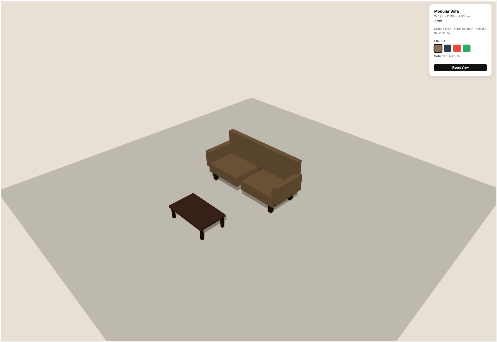

# Interactive 3D Furniture Viewer



A small React Three Fiber prototype for 3D product viewing, finish selection, and camera interaction, built as a portfolio piece for spatial and AR-oriented frontend roles.

**Live demo:** [r3f-furniture-viewer.vercel.app](https://r3f-furniture-viewer.vercel.app)  
**Portfolio:** [kpi-dashboard-six-theta.vercel.app](https://kpi-dashboard-six-theta.vercel.app)

---

## Overview

This project is a simple furniture-style 3D viewer featuring a modular sofa and coffee table in an interactive scene. It focuses on product-style interactions rather than complex 3D features.

## Features

- Interactive 3D furniture scene
- Finish selection with live color updates
- Orbit controls for rotation and zoom
- Reset view action
- Grab/grabbing cursor feedback
- Basic lighting and shadows for depth

---

## Tech Stack

- **React**
- **TypeScript**
- **React Three Fiber**
- **Three.js**
- **@react-three/drei**
- **Vite**

---

## Why I Built It

My background is in frontend engineering, with a focus on interactive UI and data visualisation. I built this prototype to get hands-on with React Three Fiber and better understand 3D scene composition in a React environment.

The goal was to explore practical product-viewer patterns: scene setup, mesh composition, lighting, camera controls, and UI-driven state changes.

---

## Engineering Notes

- Scene elements are split into focused components: `Floor`, `Sofa`, and `Table`
- Static geometry components use `memo` to reduce unnecessary re-renders
- Camera controls are constrained with `minDistance`, `maxDistance`, and `maxPolarAngle`
- Pointer state drives cursor feedback for a more natural interaction feel
- Shadows are enabled across the scene to improve visual depth

---

## Running Locally

```bash
git clone https://github.com/leomacode/r3f-furniture-viewer
cd r3f-furniture-viewer
npm install
npm run dev
```
